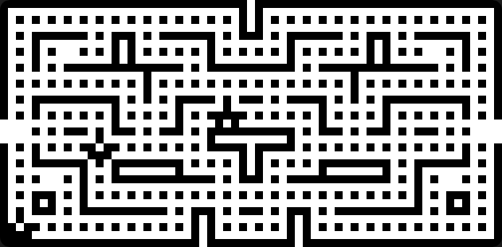

# Chip8
## Chip8 simulator

Inspired by https://www.freecodecamp.org/news/creating-your-very-own-chip-8-emulator

---

created using SDL2 (for graphics, sound and keyboard)

### NOTE:
- there is a `shell.nix` if you are Nix/Nixos fan.